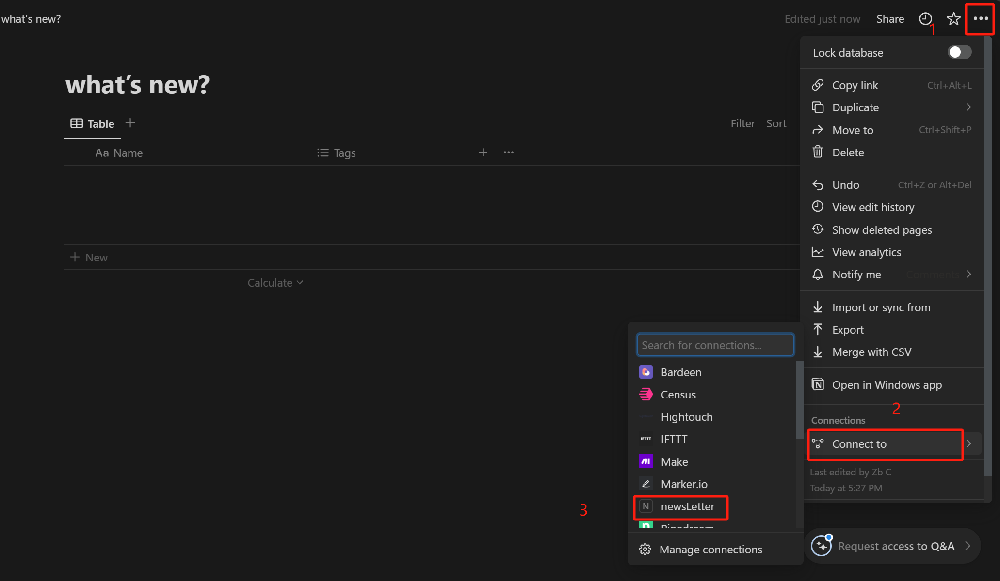
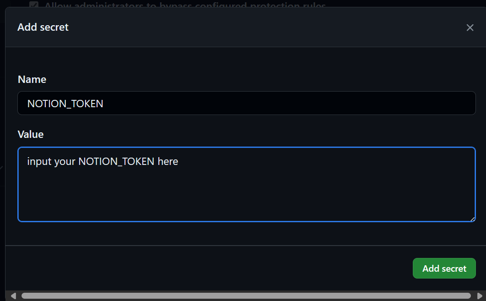

NOTE: 使用过程中有问题请提交issue.

# 0. 基础功能: 爬取相关文章到本地
1.将config.ini中的weblist下的字段替换为你感兴趣的网站;

2.将keywords下的字段替换为你感兴趣的关键词, 该脚本只会爬取标题带有关键词的文章.

3.运行UpdateNews.py后, 当前路径下会生成relavant_articles.csv和relavant_articles.xlsx文件, 包含目前为止的爬取结果.

# 1. update to notion  (Option)
1.1 修改config.ini中的 `update_to_notion` 参数为yes

1.2 设置NOTION_TOKEN环境变量

进入https://www.notion.so/my-integrations, 新建一个名为newsLetter(或者其他名字)的integration, 获取这个integration的notion token, 设置本地环境变量`NOTION_TOKEN`为这个token.

1.3 设置NOTION_PAGE_ID环境变量, 并连接到notion数据库

新建一个notion数据库后, 找到链接中的database_id.
database_id示例: 
https://www.notion.so/<A>?v=<B>
其中?v=之前的内容A是page_id.
设置环境变量`PAGE_ID`为这个page_id.

在数据库右上方, 点击connect to选项, 选择连接到
newsLetter集成

# 2. 部署到github action, 实现newsLetter功能

2.1 fork本项目到你自己的仓库

2.2 在你仓库下的NewsLetter > Settings > Environments 下, 新建一个名为newsLetter_env的环境, 在该环境中重新设置环境变量PAGE_ID, NOTION_TOKEN 以及OPENAI_API_KEY(可选), 让github action环境能够访问到它们. 注意, 在Environment secrets下设置, 而不是在Environment variables中设置! 后者会暴露你的token!

2.3 依次点击: 
Actions,
I understand my workflows, 
Python application,
Enable workflow.

2.4 测试
由于设置北京时间7点自动爬取, 为了立即测试, 你可以修改readme.md,在其后添加一个空行, 提交一个commit, 这样就会触发github action, 看一下是否成功运行.

# 3. GPT summary (Option)

3.1 确保config.ini中的`update_to_notion`参数为yes

3.2 设置环境变量`OPENAI_API_KEY`为可用的API TOKEN

note: 注意api用量, 可以先爬取一遍看一下文章数量, 然后再决定是否调用api. 如果要调用api, 重新跑一次UpdateNews.py即可.

